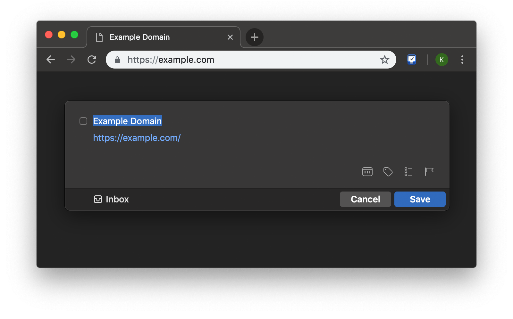
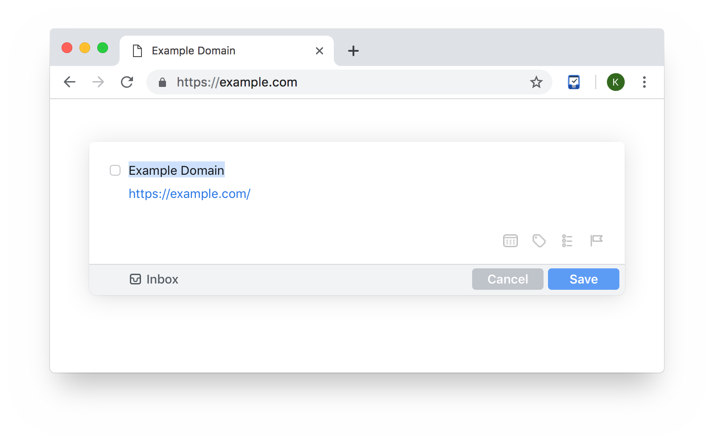

#  Add to Things

Adds currently opened page to [Things](http://culturedcode.com/things/) task manager for macOS. Page title goes to task title, URL and selected text both go to notes. 

Compatible with Dark Mode and dark themes.

  

  

---
Licensed under MIT License. Forked from [pepelsbey](https://github.com/pepelsbey/add-to-things/).
