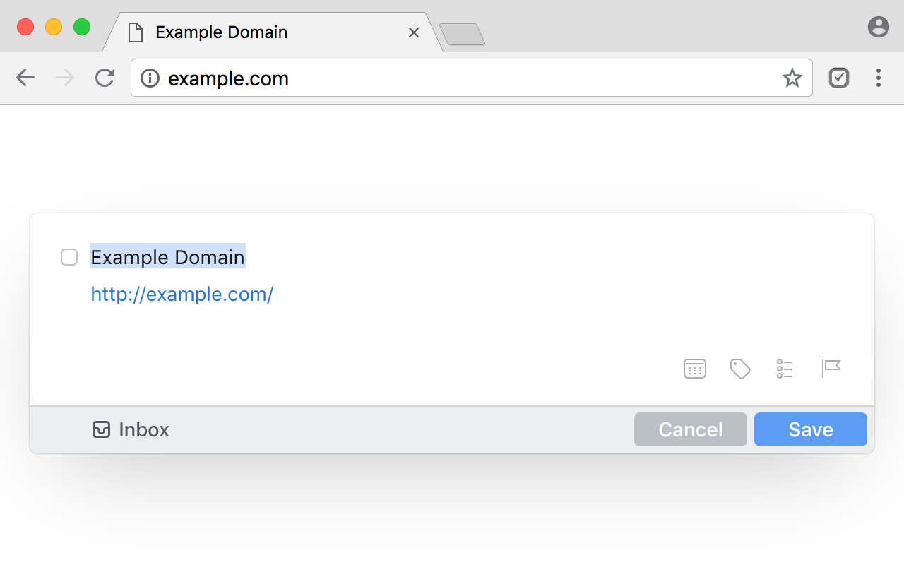
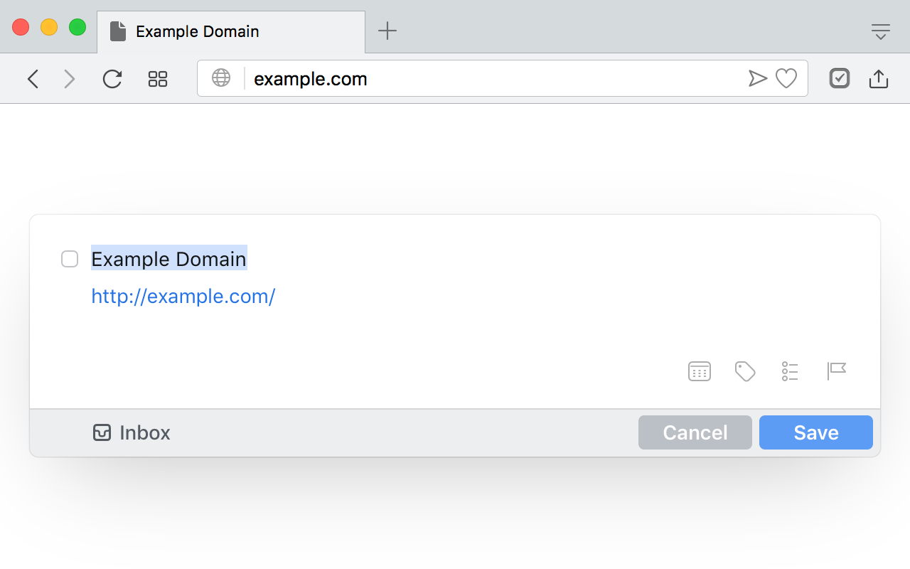

#  Add to Things

Simple extension that adds currently opened page to [Things](http://culturedcode.com/things/) task manager for OS X. Page title goes to task title, URL goes to notes. Available for [Chrome](https://chrome.google.com/webstore/detail/add-to-things/bfbgliglkhckblibeiojndpncmahbmpo) and [Opera](https://addons.opera.com/en/extensions/details/add-to-things/).

---
Licensed under MIT License
